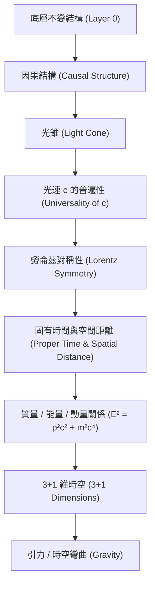

# 前時空不變量／投影假說 (Pre-spacetime Invariant / Projection Hypothesis)

> [!NOTE]
> **本文件狀態**：【提案】(Proposed)  
> 本假說僅作為基礎研究支線，目前**沒有任何候選數學定義**，亦無已成立的推導。本文件旨在定義問題邊界、推導目標與否證／失敗條件，防止後續研究陷入循環論證或無效命名。

---

## 1. 核心問題意識

在既有的「零時光網／因果相位網」研究中，我們嘗試從沒有坐標的事件與因果偏序關係中，尋求時空與物質的共湧現。然而，這引出了一個更深層的底層追問：

> **「時間、空間、光速是否不是基本量，而是某個更底層、不依賴既有時空的不變結構之湧現或投影？」**

本假說旨在探索：事件、因果關係與量子振幅本身，是否能由某個完全不預設「時空度規」或「時空拓撲」的深層不變量（Invariant）或代數／幾何結構投影而來。

---

## 2. 嚴格論證紀律與防循環論證限制

為了確保此研究支線具備實質物理與數學意義，任何候選的底層數學模型必須遵守以下鐵律：

> [!IMPORTANT]
> **非預設原則（防止循環論證）**  
> 候選的底層數學結構與基本量，**絕對不能**預先依賴或隱含以下任何既有時空概念：
> 1. 時間（Time）、空間（Space）或任何形式的外部座標系。
> 2. 距離（Distance / Interval）或度規（Metric，包含 Minkowski metric）。
> 3. 速度（Velocity）、速率上限、光速 $c$。
> 4. 勞侖茲變換（Lorentz transformation）或龐加萊對稱性。
> 
> 若候選結構在定義時即隱含了上述概念，將直接構成循環論證（以本應被解釋的物理現象作為解釋它的前提）。

---

## 3. 假說最終需要解釋與推導的目標路徑

一個合格的底層不變量投影假說，不能僅停留在哲學層面的描述。任何未來的具體數學模型，必須能夠沿著以下目標路徑，逐步且無縫地解釋或推導出宏觀物理世界：

1. **因果結構**：事件間的偏序關係如何從不變量投影中產生。
2. **光錐**：因果邊界的形成。
3. **c 的普遍性**：為什麼不同觀察者所測得的極限傳播速度皆為相同的常數 $c$。
4. **Lorentz symmetry**：在連續極限下，時空變換的勞侖茲協變性。
5. **固有時間與空間距離**：如何從離散事件關係中，定量地定義出鐘錶測得的時間與尺規測得的空間距離。
6. **質量/能量/動量關係**：推導出狹義相對論的能量-動量色散關係。
7. **3+1 維**：解釋為何我們觀測到的巨觀時空維度嚴格為 3+1 維。
8. **重力**：演化出滿足愛因斯坦場方程的時空彎曲與幾何動力學。

---

## 4. 失敗與否定條件 (Failure Conditions)

為了防止本研究支線流於虛無或重新發明輪子，特此設定明確的判定失敗標準：

> [!WARNING]
> **重新命名不等於新理論**  
> 若一個候選數學結構經過分析後，發現它只是將傳統相對論中的 **Minkowski 時空間隔（Minkowski interval）**、**四速度（Four-velocity）**、或其他**已知的相對論協變不變量**進行代數上的重新包裝或賦予新名稱，而**沒有提供更底層的物理生成機制**，則該提案直接判定為**無效／失敗**。
